# Hosting a Static Website on AWS S3 with CloudFront for Distribution....

## Project Overview
This project demonstrates how to host a static website using Amazon S3 and distribute it globally using AWS CloudFront for high availability, low latency, and security. The static website consists of HTML pages, including a main `index.html` and an `error.html` page for handling errors.

## Project Objectives
- Host a static website using Amazon S3.
- Utilize Amazon CloudFront to deliver content globally with improved performance and security.
- Automatically configure S3 bucket permissions using CloudFront Origin Access Identity (OAI).
- Set up CloudFront for caching and distributing the website content.

## Architecture Diagram
The architecture involves:
1. **S3 Bucket**: Stores the static content (HTML, CSS, JS).
2. **CloudFront Distribution**: Distributes content to edge locations worldwide, improving performance and providing SSL/TLS security.

## Steps Implemented
1. **Created an S3 Bucket:**
   - Bucket name: `static-website-om-singh`
   - Enabled static website hosting.
   - Uploaded `index.html` and `error.html` files.

2. **Set up CloudFront Distribution with OAI:**
   - Created a CloudFront distribution with the S3 bucket as the origin.
   - Configured the distribution to use `index.html` as the default root object.
   - Enabled CloudFront Origin Access Identity (OAI) to automatically create the necessary S3 bucket policy for secure access.

3. **Tested the Website:**
   - Accessed the website through the CloudFront distribution URL.
   - Verified that the static content is served globally.

## Screenshots
The following screenshots demonstrate each step of the project implementation:

1. **Creating the S3 Bucket**:

   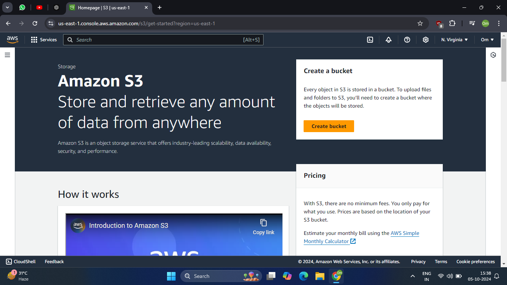
   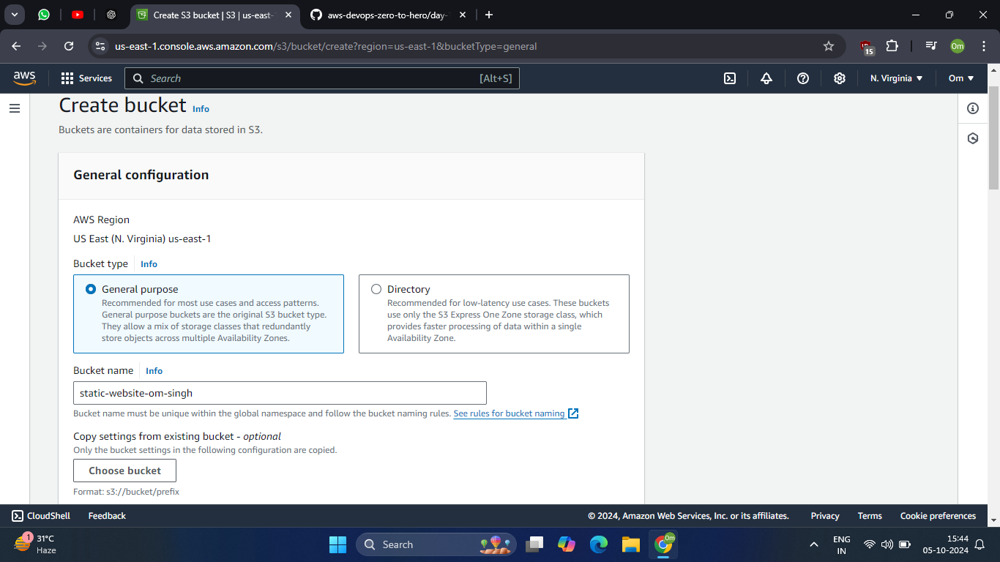
   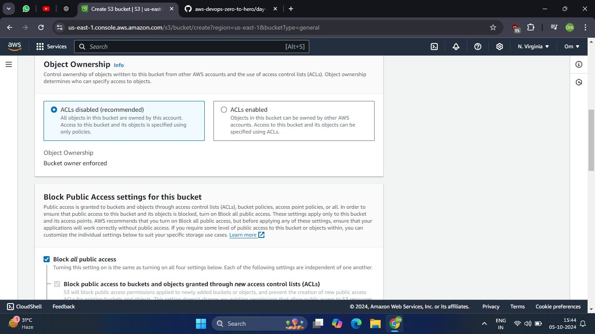
   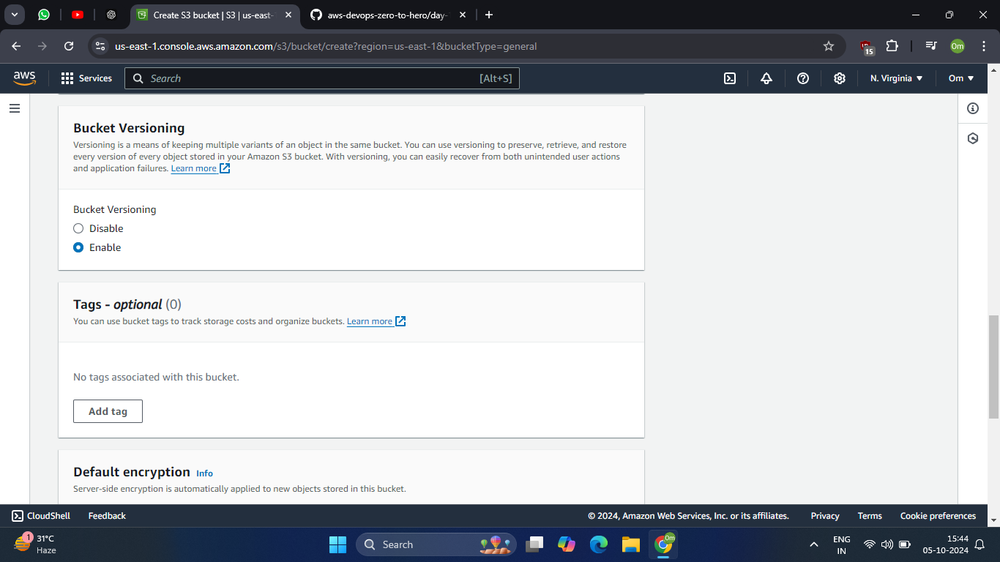
   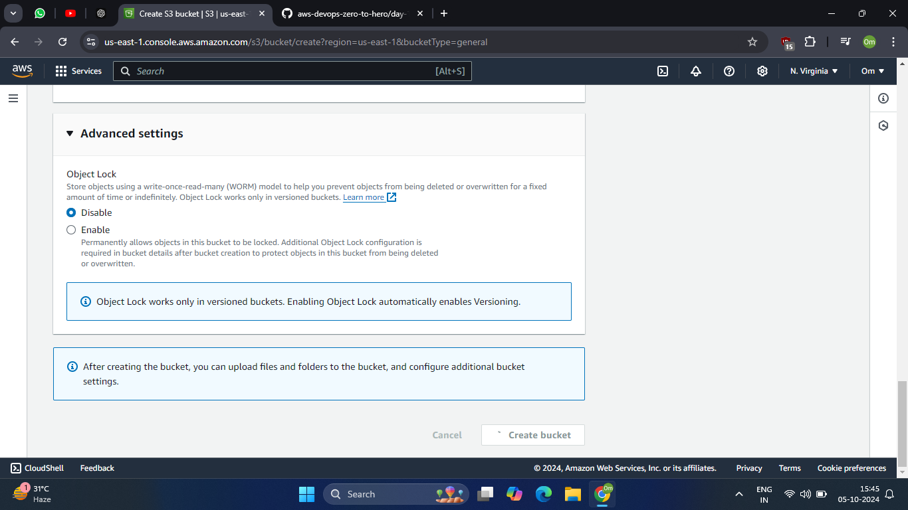
   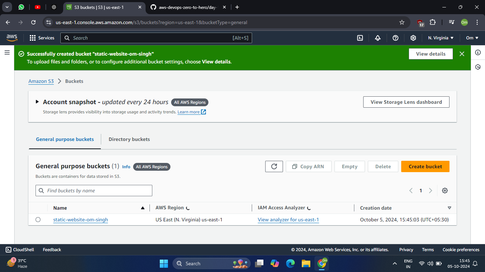

2. **Uploading Website Files**:

   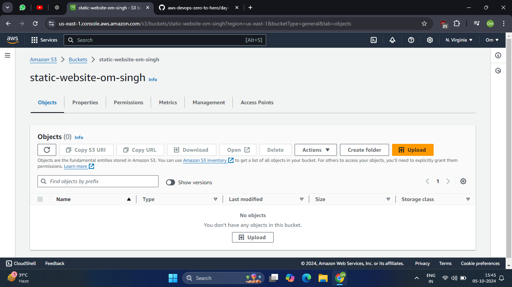
   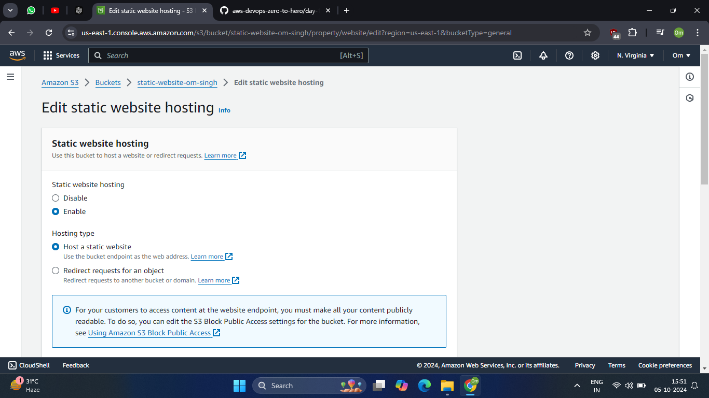
   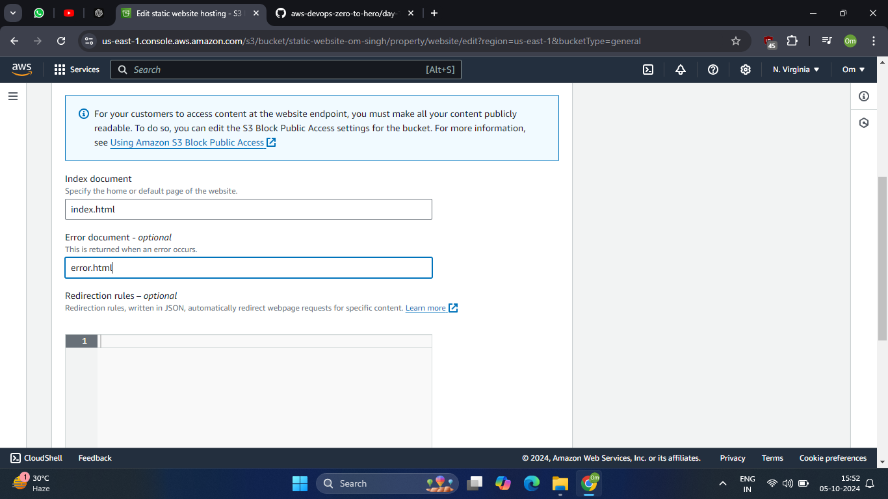
   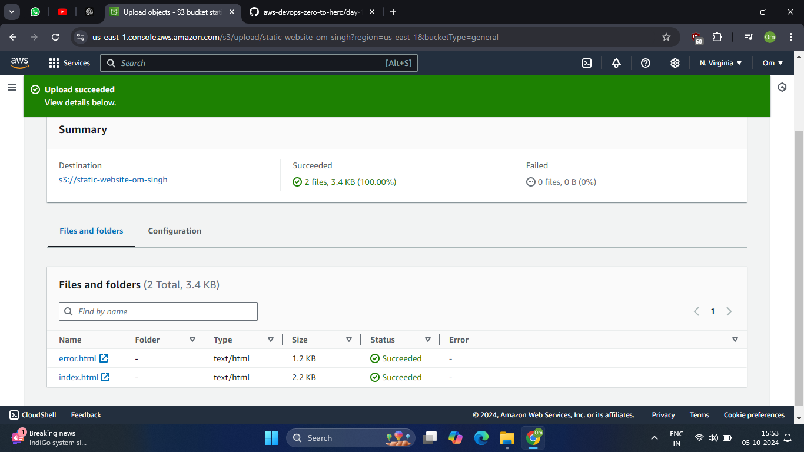

3. **Creating CloudFront Distribution with OAI**:

   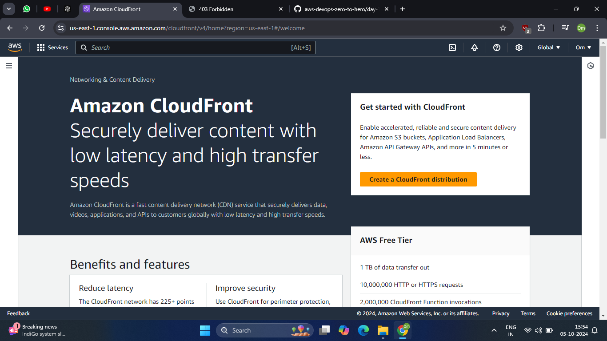
   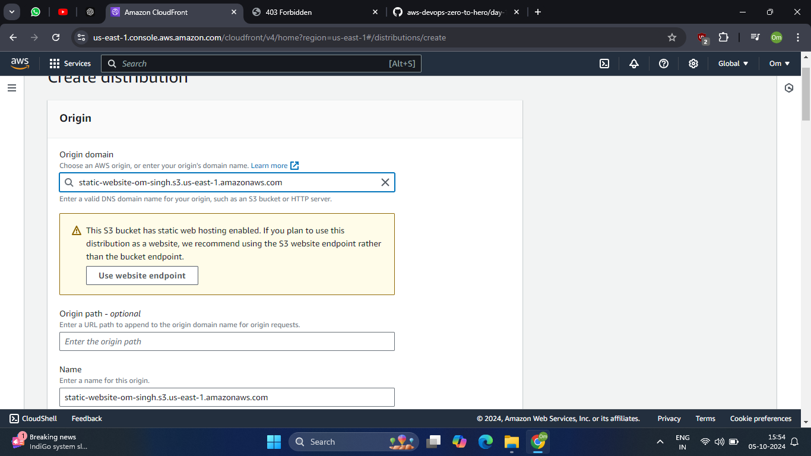
   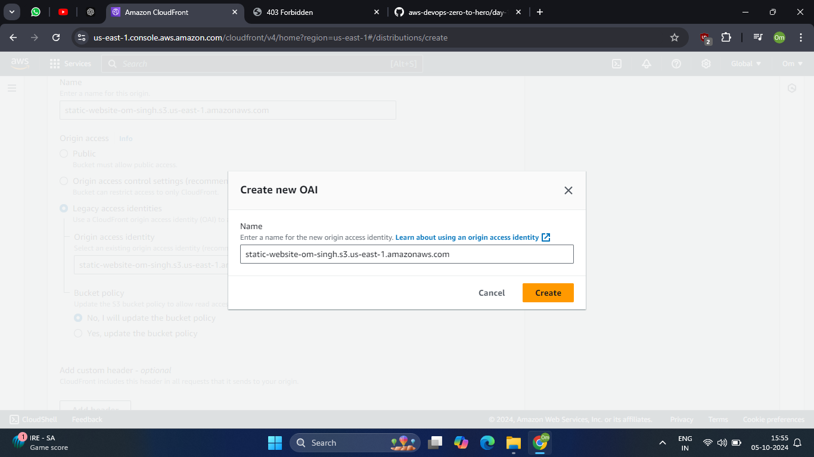
   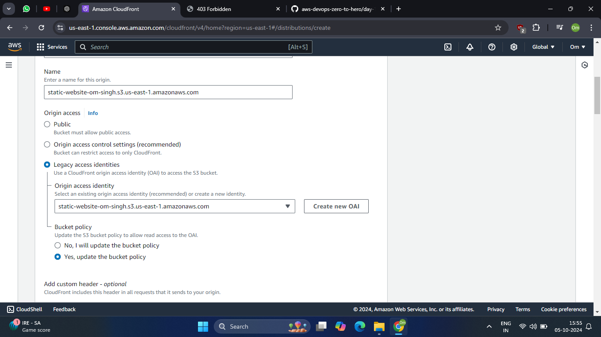
   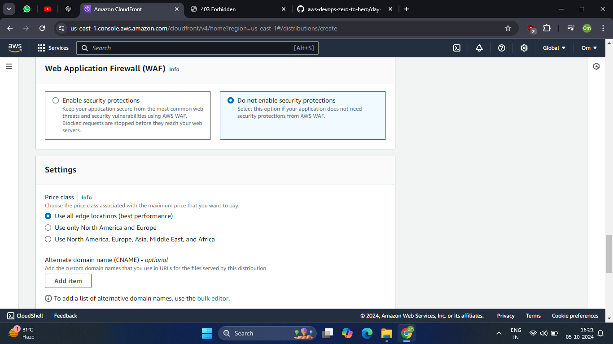
   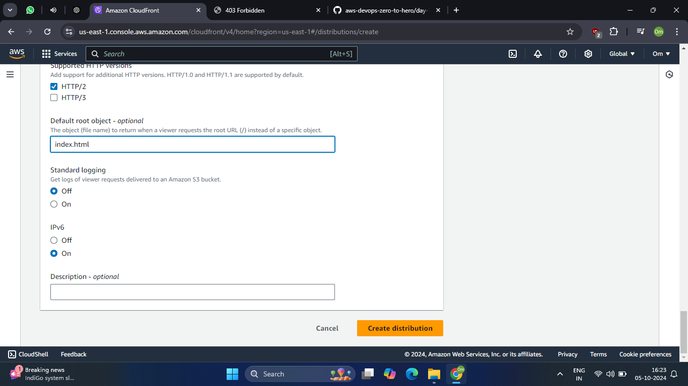

4. **Final Website Output**:

   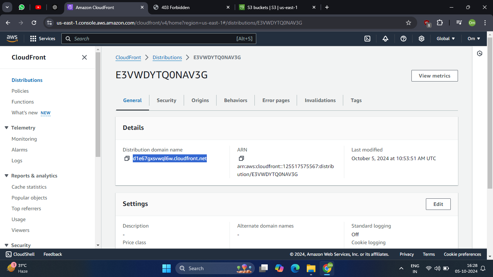
   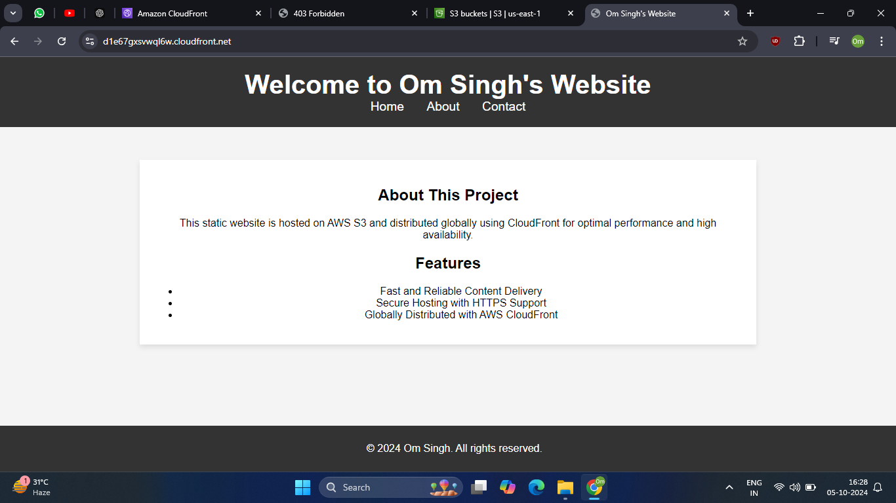

## Key Learnings
- Understanding S3 static website hosting and automatic permissions with CloudFront OAI.
- Setting up CloudFront for global content distribution and security.
- Configuring HTTPS for a secure website.

## Tools and Technologies Used
- **Amazon S3**: For hosting static content.
- **Amazon CloudFront**: For content distribution and caching.
- **AWS Management Console**: For configuration and setup.

## How to Reproduce This Project
Follow these steps to reproduce the project:

1. Create an S3 bucket and upload your static website files.
2. Enable static website hosting.
3. Create a CloudFront distribution with the S3 bucket as the origin, enabling OAI for secure access.
4. Test the CloudFront distribution URL to verify the website.

## Conclusion
This project showcases a simple yet powerful way to host a static website on AWS, leveraging S3 for storage and CloudFront for enhanced performance and security.
